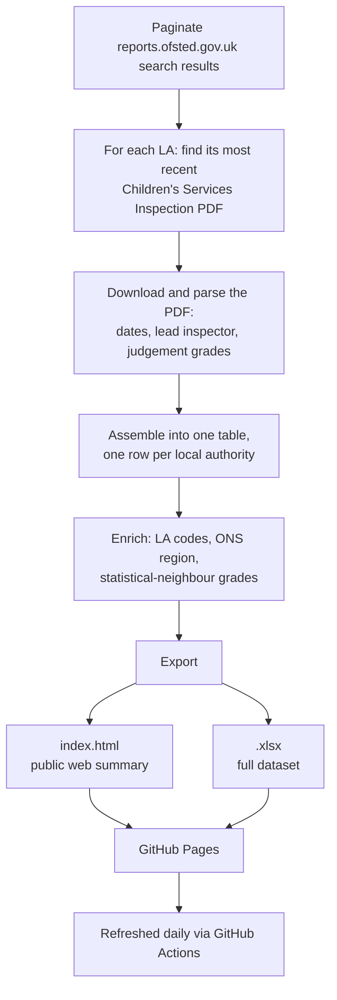

# Ofsted ILACS Scrape Tool

On-demand Ofsted ILACS results summary, built directly from Ofsted's own inspection reports rather than waiting on the periodic ADCS publication.

**Published output:** https://jt-39.github.io/ofsted-ilacs-scrape-tool/ — refreshed daily via GitHub Actions.

## What this is

D2I and a number of local authorities use the ADCS's published Ofsted ILACS Excel summary as part of their internal data workflows. That summary is only republished periodically, while Ofsted itself publishes individual inspection reports far more often, on an irregular schedule - so there's a lag between an inspection happening and it showing up in the summary LAs actually use.

This tool closes that gap: it scrapes every local authority's most recently published ILACS inspection report directly from `reports.ofsted.gov.uk`, extracts the same kind of data as the ADCS summary, and republishes it daily.

It's a **proof of concept** - "can we do this" rather than a finished product. Code readability was prioritised over architecture, and some of the scrape/cleaning logic has grown more involved than planned to handle inconsistencies in Ofsted's source data. Check the numbers before relying on this for anything critical, and feedback/contributions are welcome.

### What it does
- Scrapes every English local authority's most recent published ILACS ("Local Authority Children's Services") inspection report.
- Extracts inspection dates, lead inspector, framework type, and judgement grades.
- Enriches with historic LA codes, ONS region identifiers, and statistical-neighbour peer comparisons.
- Publishes a web summary and a downloadable spreadsheet, refreshed daily.

### What it doesn't do (yet)
- Sentiment/topic analysis of report text - early, unused reference code only (`admin/sentiment_experiment.py`), not wired into the pipeline. See [Future work](#future-work).
- Geospatial/choropleth visualisation - in progress, not active (LA boundary data doesn't cleanly map to ONS codes yet).
- Public access to the full archive of downloaded inspection PDFs from the web page - only available if you download the whole repo.
- Guarantee correct extraction for every LA on every run - a handful have known PDF-format quirks that break specific fields; see [Known limitations](#known-limitations).

## About ILACS inspections

[ILACS (Inspecting Local Authority Children's Services)](https://www.gov.uk/government/publications/inspecting-local-authority-childrens-services/inspecting-local-authority-childrens-services) is Ofsted's framework for inspecting how well local authorities in England deliver children's social care. It combines local authorities' own annual self-evaluations, an annual engagement meeting with Ofsted, Ofsted's own intelligence data on each LA, focused visits, and full inspections - standard inspections for LAs judged to need improvement, short inspections for those judged good or outstanding.

**From 1 April 2026 the framework changed significantly** (see Ofsted's [summary of framework changes](https://www.gov.uk/government/publications/inspecting-local-authority-childrens-services/summary-of-framework-changes)): the single headline **overall effectiveness** judgement was removed entirely. Ofsted's stated reason, from feedback gathered during the "Big Listen", was that a single-word overall judgement over-simplified the complexity of the work. Inspections now report four judgements instead of five:

| Judgement | Reported post-April 2026? |
|---|---|
| Impact of leaders on (social work) practice with children and families | Yes |
| Experiences and progress of children who need help and protection | Yes |
| Experiences and progress of children in care | Yes |
| Experiences and progress of care leavers | Yes |
| ~~Overall effectiveness~~ | **No — removed** |

Whether a local authority gets a focused visit ahead of its next short inspection is now based on being judged good/outstanding on impact of leaders and at least two of the three practice judgements, rather than on the old overall-effectiveness grade. See [North Northamptonshire's May 2026 inspection report](https://files.ofsted.gov.uk/v1/file/50306784) for a real example of the new report format.

This tool reflects the change directly: for any LA inspected from ~April 2026 onwards, `overall_effectiveness_grade` in the output shows `not_reported_post_reform` rather than a grade - see [Known limitations](#known-limitations).

## How it works

The whole pipeline runs as a single Python script, `ofsted_ilacs_scrape.py`, read top to bottom: config, then function definitions, then the pipeline itself runs in sequence at the bottom.

## Output

Three things come out of a run:

- **Web summary** (`index.html`) - a trimmed, published subset of the results.
- **Full spreadsheet** (`ofsted_csc_ilacs_overview.xlsx`) - the complete dataset, also downloadable from the web summary.
- **Downloaded inspection PDFs** (`export_data/inspection_reports/<urn>_<la_name>/`) - packaged per LA. Not currently published to the web page; download the full repo/`export_data` folder to access these alongside the spreadsheet's active hyperlinks to them.

### Data sources used for enrichment
- `import_data/la_lookup/` - historic LA codes, ONS region identifiers, and each LA's statistical neighbours, joined in by URN.
- `import_data/geospatial/` - reduced GeoJSON boundary data for future map/choropleth use (not yet wired in - see [Future work](#future-work)).

## Known limitations

**Ofsted's April 2026 framework change** (see [above](#about-ilacs-inspections)) is expected behaviour, not a bug - `overall_effectiveness_grade` correctly shows `not_reported_post_reform` for LAs inspected since then, and this is excluded from the CI validation's failure checks.

**Genuine per-LA extraction bugs** - a handful of LAs have PDF encoding or formatting quirks that break extraction of specific fields. We're working through these:
- southend-on-sea: overall, help_and_protection_grade, care_leavers_grade
- nottingham: inspection_framework, inspection_date
- redcar and cleveland: inspection_framework, inspection_date
- knowsley: inspector_name
- stoke-on-trent: inspector_name

**General fragility** - the scrape/parse logic depends entirely on Ofsted's current site structure and PDF layout, both outside this project's control and both of which have changed before.

## Future work

- **Sentiment analysis** - early reference code lives, unused, in `admin/sentiment_experiment.py` (`sentiment_score`, `sentiment_summary`, `main_inspection_topics`, `inspectors_median_sentiment_score` columns) as a starting point for anyone who wants to develop it further. Not wired into the pipeline or output, and inclusion of these columns wouldn't imply the scores are accurate - a discussion starting point only.
- **Geospatial visualisation** - the basis is in place, but LA/county boundary data doesn't cleanly map to ONS codes yet.
- **Full report archive on the web front end** - currently only available by downloading the whole repo, since the PDF archive isn't published to GitHub Pages.
- Further development/bespoke work to tie in with existing LA workflows that could use this tool or its data.

Contact: datatoinsight.enquiries@gmail.com

## Using the tool

Run in a GitHub Codespace:

1. Create a new Codespace (on `main`).
2. `./setup.sh` (`chmod +x setup.sh` first if you get a permissions error) - installs Python dependencies via `uv` into `.venv`.
3. Run the script: `uv run python ofsted_ilacs_scrape.py` at the terminal, or right-click the file → "Run Python File" (accept VS Code's prompt to use the `.venv` interpreter `./setup.sh` just created, otherwise the run will fail with missing packages).
4. Download the refreshed `ofsted_csc_ilacs_overview.xlsx`.
5. Close the Codespace - GitHub will clean up unused ones automatically.
